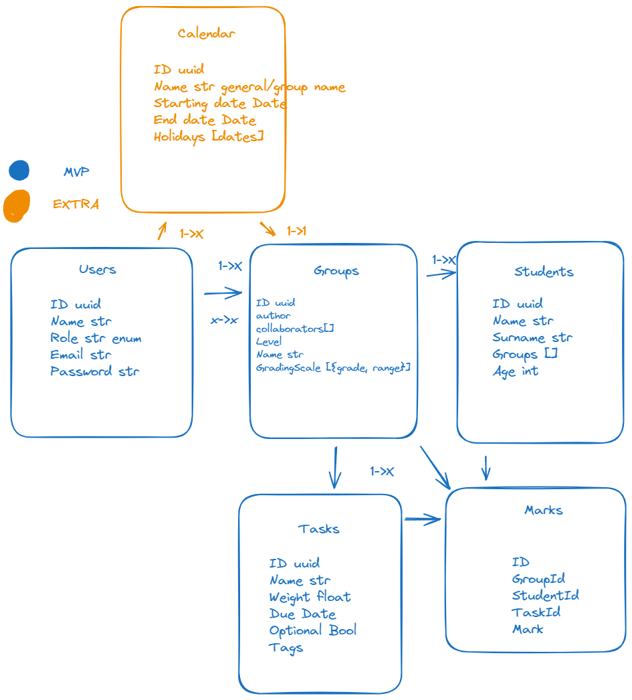

# ScholarTrack

### IMPORTANT

- The IDs referenced in the thunder collections are an example and do not represent real IDs. The following IDs ARE REAL.

<details>
  <summary>Content 📝</summary>
  <ol>
    <li><a href="#about-the-project">About the project</a></li>
    <li><a href="#goal">Goal</a></li>
    <li><a href="#deployment-🚀">Deployment</a></li>
    <li><a href="#stack">Stack</a></li>
    <li><a href="#local-installation">Installation</a></li>
    <li><a href="#diagram">Diagram</a></li>
    <li><a href="#endpoints">Endpoints</a></li>
    <li><a href="#roadmap">Roadmap</a></li>
    <li><a href="#author">Authort</a></li>
  </ol>
</details>

## About the project
This was the final project for an FSD bootcamp at GeeksHubs Academy. The project consisted in designing and making a full webapp from scratch, back and front. This is the back of the project. I decided to make an app for teachers to create groups, students and tasks and easily mark the tasks and get the correctly weighted final marks for each student.

## Goal
The project required us to make a database and a REST API

The API had to include the crud of at least 2 of the entities in the diagram. I opted to full crud of all of them since it made sense for the project. 

## Deployment 🚀
<div align="center">
    Comming soon
</div>

## Stack
Technologies employed:
<div align="center">
<a href="https://www.mongodb.com/">
    
</a>
<a href="https://www.expressjs.com/">
    
</a>
<a href="https://nodejs.org/es/">
    
</a>
<a href="https://developer.mozilla.org/es/docs/Web/JavaScript">
    
</a>
 </div>


## Installation
1. Clone the repo: ` $ git clone https://github.com/Eryhnar/ScholarTrack.git`
2. ` $ npm install `
3. Create a mondodb database. I recommend using docker for this step.
4. Set the .env file and adjust the params for the database.
5. Connect to the database. If the .env is set properly, executing the following command within the ide console will connect to the database ``` $ npm run dev ```
6. Import the routes from the thunder routes collection folder.

## Diagram


## Endpoints
<details>
<summary>Endpoints</summary>
    
    
### Register

**Endpoint:** `/api/auth/register`

**Method:** `POST`

**Description:** This endpoint allows a user to register.

**Headers:**

- none

**Request Body:**

- `name`: 
- `email`: something@something.domain
- `password`: minimum one capital letter, one lowercase and a number. Length 8-14. Accepts . - _

**Responses:**

- `201 OK`
- `400 Bad Request`
- `500 Internal Server Error`

**Example Request:**

```json
{
    "name": "michael", 
    "email": "michael@michael.com", 
    "password": "Aa123456"
}
```
**Example Response:** 
```json
{
    "success": true,
    "message": "User registered successfully"
}
```
### Log in

**Endpoint:** `/api/auth/login`

**Method:** `POST`

**Description:** This endpoint allows a user to log in.

**Headers:**

- none

**Request Body:**

- `email`: something@something.domain
- `password`: minimum one capital letter, one lowercase and a number. Length 8-14. Accepts . - _

**Responses:**

- `200 OK`
- `400 Bad Request`
- `404 Not Found`
- `500 Internal Server Error`

**Example Request:**

```json
{
    "email": "michael@michael.com", 
    "password": "Aa123456"
}
```
**Example Response:** 
```json
{
    "success": true,
    "message": "User  successfully"
}
```
### Update User Profile

**Endpoint:** `/api/user/profile`

**Method:** `PUT`

**Description:** This endpoint allows users to update their profile information.

**Headers:**

- `Authorization`: Bearer token for user authentication. This token must be included in the headers of the request.

**Example Headers:**

```json
{
    "Authorization": "Bearer your_token_here"
}
```

**Request Body:**

- `name` (string, optional): New username.

**Example Request Body:**
```json
{
    "name": "newName",
}
```
**Responses:**

- `200 OK:` The profile was successfully updated. Returns the updated user profile data.
- `400 Bad Request:` The request body is invalid or missing required fields. Returns an error message detailing the issue.
- `401 Unauthorized:` The user is not authenticated. Returns an error message.
- `500 Internal Server Error:` An error occurred on the server while trying to update the profile. Returns an error message.

### Update User Password

**Endpoint:** `/api/user/profile/password`

**Method:** `PUT`

**Description:** This endpoint allows a user to update their password.

**Headers:**

- `Authorization`: Bearer token for authenticating the user. This should be included in all requests to this endpoint.

**Example Headers:**

```json
{
    "Authorization": "Bearer your_token_here"
}
```
**Request Body:**

- `currentPassword:` The user's current password.
- `newPassword:` The user's new password.
- `confirmNewPassword:` Confirmation of the user's new password.

**Responses:**

- `200 OK:` The password was successfully updated. Returns a success message.
- `400 Bad Request:` The new passwords do not match, the old password is incorrect, or the password does not meet the required criteria. Returns an error message.
- `401 Unauthorized:` The user is not authenticated or the old password is incorrect. Returns an error message.
- `500 Internal Server Error:` An error occurred on the server while trying to update the password. Returns an error message.

**Example Request:**

```json
{
    "currentPassword": "oldPassword123",
    "newPassword": "newPassword123",
    "confirmNewPassword": "newPassword123"
}
```
**Example Response:**
```json
{
    "success": true,
    "message": "User password updated successfully"
}
```

### Deactivate User Profile

**Endpoint:** `/api/users/profile/suspend`

**Method:** `PUT`

**Description:** This endpoint allows a user to deactivate their profile.

**Headers:**

- `Authorization`: Bearer token for authenticating the user. This should be included in all requests to this endpoint.

**Example Headers:**

```json
{
    "Authorization": "Bearer your_token_here"
}
```

**Responses:**

- `200 OK:` The profile was successfully deactivated. Returns a success message.
<!-- - `400 Bad Request:` The provided password is incorrect. Returns an error message. -->
- `401 Unauthorized:` The user is not authenticated. Returns an error message.
- `404 Not Found:` The user was not found. Returns an error message.
- `500 Internal Server Error:` An error occurred on the server while trying to deactivate the profile. Returns an error message.
**Example Request:**

### Create Group
**Endpoint:** /api/group

**Method:** POST

**Description:** This endpoint allows a user to create a group.

**Headers:**

**Authorization:** Bearer token for authenticating the user. This should be included in all requests to this endpoint.
**Body:**

- `name`: The name of the group.
- `level`: The level of the group.

**Response:**

201 Created: The group was successfully created. Returns the created group.

### Get Own Groups
**Endpoint:** /api/group

**Method:** GET

**Description**: This endpoint allows a user to get their own groups.

**Headers:**

**Authorization:** Bearer token for authenticating the user. This should be included in all requests to this endpoint.
**Response:**

200 OK: The groups were successfully fetched. Returns the user's groups.
### Edit Own Group By Id
**Endpoint:** /api/group/:groupId

**Method:** PUT

**Description:** This endpoint allows a user to edit their own group by its id.

**Headers:**

**Authorization:** Bearer token for authenticating the user. This should be included in all requests to this endpoint.
**Body:**

`name`: The new name of the group.
`level`: The new level of the group.
**Response:**

200 OK: The group was successfully updated. Returns the updated group.
### Delete Own Group By Id
**Endpoint:** /api/group/:groupId

**Method:** DELETE

**Description:** This endpoint allows a user to delete their own group by its id.

**Headers:**

**Authorization:** Bearer token for authenticating the user. This should be included in all requests to this endpoint.
**Response:**

200 OK: The group was successfully deleted. Returns a success message.
### Get Group By Id
**Endpoint:** /api/group/:groupId

**Method:** GET

**Description:** This endpoint allows a user to get a group by its id.

**Headers:**

**Authorization:** Bearer token for authenticating the user. This should be included in all requests to this endpoint.
**Response:**

200 OK: The group was successfully fetched. Returns the group.
404 Not Found: The group was not found. Returns an error message.

## Student Routes

### Create Student

**Route:** /api/student

**Method:** POST

**Description:** Creates a new student.

**Headers:**
```json
{
    "Authorization": "Bearer your_token_here"
}
```

**Body:**
```json
{
    "name": "John",
    "surname": "Doe",
    "age": 21,
    "group": "Group1"
}
```

**Responses:**

201 Created: The student was successfully created. Returns the created student.
400 Bad Request: The provided data is incorrect. Returns an error message.
401 Unauthorized: The user is not authenticated. Returns an error message.
403 Forbidden: The user is not authorized to create a student in this group. Returns an error message.
500 Internal Server Error: An error occurred on the server while trying to create the student. Returns an error message.

### Get Group Overview

**Route:** /api/student/overview/:groupId

**Method:** GET

**Description:** Gets an overview of all students in a group. This includes their final attendance and marks

**Headers:**
```json
{
    "Authorization": "Bearer your_token_here"
}
```

**Responses:**

200 OK: The students were successfully fetched. Returns the students.
400 Bad Request: The provided groupId is incorrect. Returns an error message.
401 Unauthorized: The user is not authenticated. Returns an error message.
403 Forbidden: The user is not authorized to view this group. Returns an error message.
404 Not Found: The group was not found. Returns an error message.
500 Internal Server Error: An error occurred on the server while trying to fetch the students. Returns an error message.

### Get Group Students

**Description:** Gets all students in a group.

**Route:** /api/student/:groupId

**Method:** GET

**Headers:**

```json
{
    "Authorization": "Bearer your_token_here"
}
```

**Responses:** 

200 OK: The students were successfully fetched. Returns the students.
400 Bad Request: The provided groupId is incorrect. Returns an error message.
401 Unauthorized: The user is not authenticated. Returns an error message.
403 Forbidden: The user is not authorized to view this group. Returns an error message.
404 Not Found: The group was not found. Returns an error message.
500 Internal Server Error: An error occurred on the server while trying to fetch the students. Returns an error message.

### Update Student

**Description:** Updates a student by ID in a group.

**Route:** /api/student/:groupId/:studentId

**Method:** PUT

**Headers:**
```json
{
    "Authorization": "Bearer your_token_here"
}
```

**Body:**
```json
{
    "name": "John",
    "surname": "Doe",
    "age": 21,
    "group": "Group1"
}
```

**Responses:**

200 OK: The student was successfully updated. Returns the updated student.
400 Bad Request: The provided groupId, studentId or data is incorrect. Returns an error message.
401 Unauthorized: The user is not authenticated. Returns an error message.
403 Forbidden: The user is not authorized to update this student. Returns an error message.
404 Not Found: The student or group was not found. Returns an error message.
500 Internal Server Error: An error occurred on the server while trying to update the student. Returns an error message.

### Archive Student

**Description:** Archives a student. Acts as a soft delete for most cases.

**Route:** /api/student/:groupId/:studentId/archive

**Method:** PUT

**Headers:**
```json
{
    "Authorization": "Bearer your_token_here"
}
```

**Responses:**

200 OK: The student was successfully archived. Returns a success message.
400 Bad Request: The provided groupId or studentId is incorrect. Returns an error message.
401 Unauthorized: The user is not authenticated. Returns an error message.
403 Forbidden: The user is not authorized to archive this student. Returns an error message.
404 Not Found: The student or group was not found. Returns an error message.
500 Internal Server Error: An error occurred on the server while trying to archive the student. Returns an error message.

### Delete Student

**Description:** Deletes a student.

**Route:** /api/student/:groupId/:studentId

**Method:** DELETE

**Headers:** 
```json
{
    "Authorization": "Bearer your_token_here"
}
```

**Responses:**

200 OK: The student was successfully deleted. Returns a success message.
400 Bad Request: The provided groupId or studentId is incorrect. Returns an error message.
401 Unauthorized: The user is not authenticated. Returns an error message.
403 Forbidden: The user is not authorized to delete this student. Returns an error message.
404 Not Found: The student or group was not found. Returns an error message.
500 Internal Server Error: An error occurred on the server while trying to delete the student. Returns an error message.

## Task Routes

### Create Task

**Route:** /api/task/:groupId/:groupId

**Method:** POST

**Headers:** 
```json
{
    "Authorization": "Bearer your_token_here"
}
```

**Body:**
```json
{
    "name": "The name of the task.", //(required)
    "description": "The description of the task.",
    "deadline": "The deadline of the task.",
    "weight": "The weight of the task", //must be between 1 and 100. //(required),
    "optional": "Whether the task is optional.",
    "tags": "The tags associated with the task.",
}
```

**Responses:** 

- 201: Task created successfully.
- 400: Invalid input.
- 403: Unauthorized access.

### Get all Group Tasks

**Description:** Gets all tasks belonging to a group.

**Route:** /api/task/:groupId

**Method:** GET

**Headers:** 
```json
{
    "Authorization": "Bearer your_token_here"
}
```

**Responses:**

- 200: Tasks fetched successfully.
- 400: Invalid input.
- 403: Unauthorized access.

### Get Task by Id

**Description:** Gets a task by id

**Route:** api/task/:groupId/:taskId

**Method:** GET

**Headers:** 
```json
{
    "Authorization": "Bearer your_token_here"
}
```

**Responses:** 

- 200: Task fetched successfully.
- 400: Invalid input.
- 403: Unauthorized access.


### Edit Task

**Description:** Edits a task.

**Route:** api/task/:groupId/:taskId

**Method:** PUT

**Headers:** 
```json
{
    "Authorization": "Bearer your_token_here"
}
```

**Body:** 
```json
{
    "name": ,//"The new name of the task",
    "description": ,//"The new description of the task",
    "deadline": ,//"The new deadline of the task",
    "weight": ,//"The new weight of the task, must be between 1 and 100",
    "optional": ,//"Whether the task is optional",
    "tags": //[]"MUST BE AN ARRAY. The new tags associated with the task"
}
```

**Responses:**

- 200: Task edited successfully.
- 400: Invalid input.
- 403: Unauthorized access.

### Delete Task

**Description:** Deletes a task.

**Route:** api/task/:groupId/:taskId

**Method:** DELETE

**Headers:** 
```json
{
    "Authorization": "Bearer your_token_here"
}
```

**Responses:**

- 200: Task deleted successfully.
- 400: Invalid input.
- 403: Unauthorized access.

## Mark Routes

### Create Mark

**Description:** Creates a mark.

**Route:** /api/mark/:groupId/:taskId/:studentId

**Method:** POST

**Headers:** 
```json
{
    "Authorization": "Bearer your_token_here"
}
```

**Body:**
```json
{
    "value": "The value of the mark"// (required)
}
```

**Responses:**

- 201: Mark created successfully.
- 400: Invalid input.
- 403: Unauthorized access.

### Get Group Marks

**Description:** Fetches all marks of a given group

**Route:** /api/mark/:groupId

**Method:** GET

**Headers:** 
```json
{
    "Authorization": "Bearer your_token_here"
}
```

**Responses:**

- 200: Marks fetched successfully.
- 400: Invalid input.
- 403: Unauthorized access.

### Edit a mark

**Descriptions:** Edit a given mark.

**Route:** /api/mark/:groupId/:markId

**Method:** PUT

**Headers:** 
```json
{
    "Authorization": "Bearer your_token_here"
}
```

**Body:**
```json
{
    "value": "The new value of the mark." //(required)
}
```

**Responses:**

- 200: Mark edited successfully.
- 400: Invalid input.
- 403: Unauthorized access.

### Delete Mark

**Description:** Deletes a mark.

**Route:** /api/mark/:groupId/:markId

**Method:** DELETE

**Headers:** 
```json
{
    "Authorization": "Bearer your_token_here"
}
```

**Responses:**

- 200: Mark deleted successfully.
- 400: Invalid input.
- 403: Unauthorized access.

</details>

## Credentials
    These are some of the credentials provided in the seeder.
    - user@user.com password: Aa123456 user

## Roadmap
- Review code to unify some parts where functions still keep the old approach.
- Clean up code.
- Add testing.
- Add attendance crud.
- Add calendar crud.
- Add Session crud.
- Reimplement methods that require batch operations when the issues with the cluster are fixed.

## Author 

- **Pedro Fernández** - Project Developer
  - [GitHub](https://github.com/Eryhnar) - [LinkedIn](https://www.linkedin.com/in/pedro-fernandez-bel-68a2b9155/)